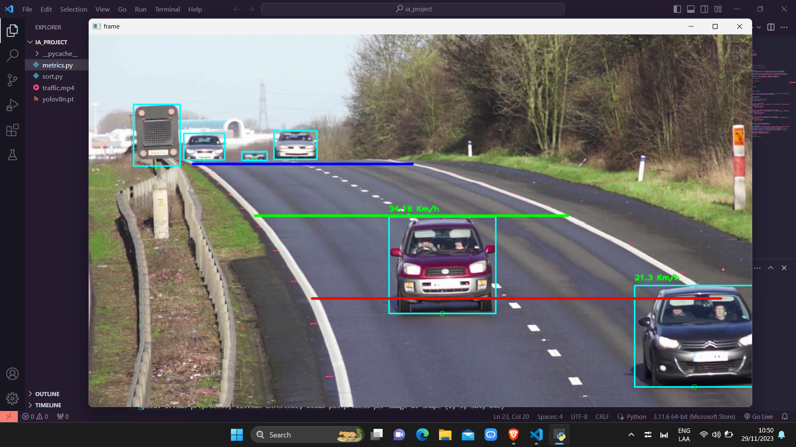

# AI Project

In this repository you will find the source code to visualize a video and calculate the speed that these vehicles have when passing.


If you would like to upload your own video you should consider the following:

- The name does not necessarily have to be the same, however you should change it in the code in line `41`.
  
  ```python
      cap = cv2.VideoCapture("traffic.mp4")
  ```

- In the same way you should change the coordinates where your objects will be passing in the video `[(x,y), (x,y)]`.

    ```python
    BLUE_LINE = [(200,250), (625,250)]
    GREEN_LINE = [(320,350), (925,350)]
    RED_LINE = [(430,510), (1220,510)]
    ```

All modifications you want to make, mostly concentrated in the [metrics.py](metrics.py) file.

## Problems?

It can usually give problems of dependency on your machine so you may need to run `pip install [dependency]` on your terminal.

> Example with 1 or more vehicles.
> 
> Thanks for watching!